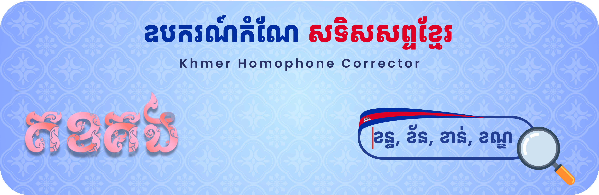

# Khmer Homophone Corrector

A web application for correcting homophones in Khmer text using deep learning. Built with Streamlit and powered by a custom transformer model.



## 🌟 Features

- **Real-time Khmer text correction**: Input Khmer text and get instant homophone corrections
- **Deep learning model**: Powered by a custom PrahokBART model trained specifically for Khmer language 
- **Interactive UI**: Clean, user-friendly interface with real-time processing
- **Comprehensive homophone database**: Includes 268+ homophone groups for reference
- **Correction highlighting**: Shows exactly what changes were made to your text
- **Word segmentation**: Advanced Khmer text processing with proper word tokenization

## 🚀 Live Demo

Visit the live application: [Khmer Homophone Corrector](https://khmerhomophonecorrector.streamlit.app)

## 📋 Prerequisites

- Python 3.8 or higher
- pip package manager

## 🛠️ Installation

### Local Setup

1. **Clone the repository**:
   ```bash
   git clone https://github.com/SocheataSokhaChan22/khmerhomophonecorrector.git
   cd khmerhomophonecorrector
   ```

2. **Install dependencies**:
   ```bash
   pip install -r requirements.txt
   ```

3. **Run the application**:
   ```bash
   streamlit run app.py
   ```

4. **Open your browser** and navigate to `http://localhost:8501`

## 📦 Dependencies

- `streamlit` - Web application framework
- `transformers` - Hugging Face transformers library
- `torch` - PyTorch for deep learning
- `khmer-nltk` - Khmer natural language processing

## 🎯 Usage

1. **Input Text**: Type or paste your Khmer text in the input area
2. **Process**: Click the "🔄 Correct Text" button
3. **View Results**: See the corrected text and any changes made
4. **Reference**: Browse the homophone examples to understand what can be corrected

## 🔧 How It Works

The application uses a custom MBart model trained on Khmer homophone pairs:

1. **Text Preprocessing**: Input text is segmented using Khmer word tokenization
2. **Model Processing**: The transformer model processes the segmented text
3. **Correction Generation**: The model generates corrected text with proper homophones
4. **Difference Detection**: Changes are highlighted and explained to the user

## 📊 Model Information

- **Model Type**: MBartForConditionalGeneration
- **Training Data**: Custom Khmer homophone dataset
- **Hosted On**: Hugging Face Hub
- **Model Path**: `socheatasokhachan/khmerhomophonecorrector`

## 📚 Research Citation

This project builds upon research in Khmer natural language processing, particularly:

**PrahokBART: A Pre-trained Sequence-to-Sequence Model for Khmer Natural Language Generation**
- Authors: Hour Kaing, Raj Dabre, Haiyue Song, Van-Hien Tran, Hideki Tanaka, Masao Utiyama
- Published: COLING 2025
- DOI: [https://aclanthology.org/2025.coling-main.87.pdf](https://aclanthology.org/2025.coling-main.87.pdf)
- GitHub: [https://github.com/hour/prahokbart](https://github.com/hour/prahokbart)
- Hugging Face: [https://huggingface.co/prajdabre/prahokbart](https://huggingface.co/prajdabre/prahokbart)

## 🌐 Deployment

### Streamlit Cloud

This application is deployed on Streamlit Cloud:

1. **Automatic Deployment**: Changes pushed to GitHub are automatically deployed
2. **Live Updates**: The app updates within minutes of code changes
3. **Scalable**: Handles multiple users simultaneously

### Manual Deployment

To deploy on your own Streamlit Cloud instance:

1. Fork this repository
2. Connect your GitHub account to Streamlit Cloud
3. Deploy using the repository URL
4. Set the main file to `app.py`

## 📁 Project Structure

```
khmer-homophone-corrector/
├── app.py                 # Main Streamlit application
├── requirements.txt       # Python dependencies
├── homophone_test.json   # Homophone database
├── header.png            # Application header image
└── README.md             # Project documentation
```

## 🤝 Contributing

Contributions are welcome! Please feel free to submit a Pull Request.

## 📄 License

This project is licensed under the MIT License.

## 👨‍💻 Author

**Socheata Sokhachan**
- GitHub: [@SocheataSokhaChan22](https://github.com/SocheataSokhaChan22)
- Project Website: [Khmer Homophone Corrector](https://sites.google.com/paragoniu.edu.kh/khmerhomophonecorrector/home)

## 🙏 Acknowledgments

- Hugging Face for the transformers library
- Streamlit for the web framework
- The Khmer NLP community for language resources

---

**Note**: This application is designed specifically for Khmer language homophone correction and may not work optimally with other languages.
